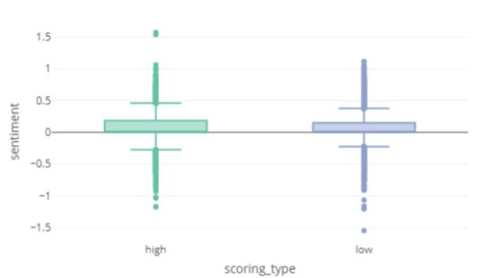
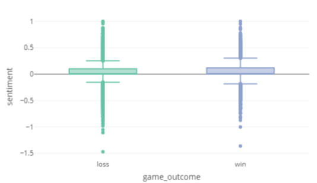
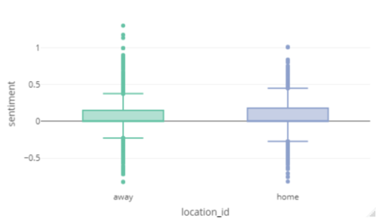
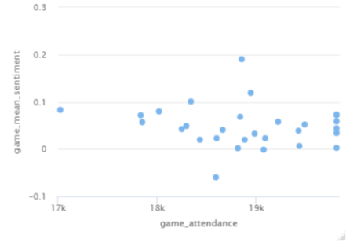
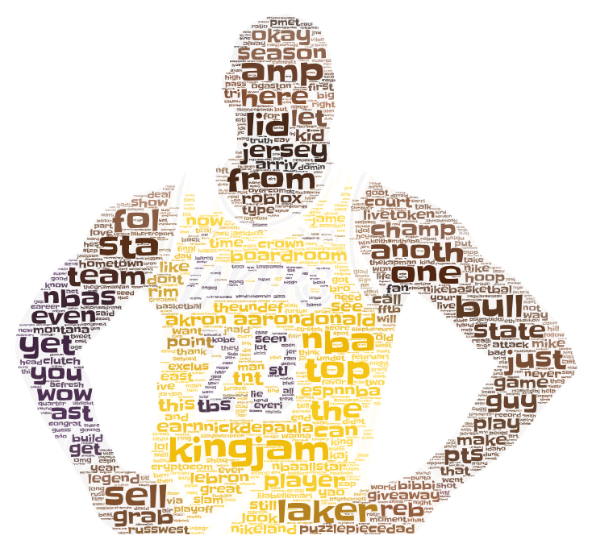
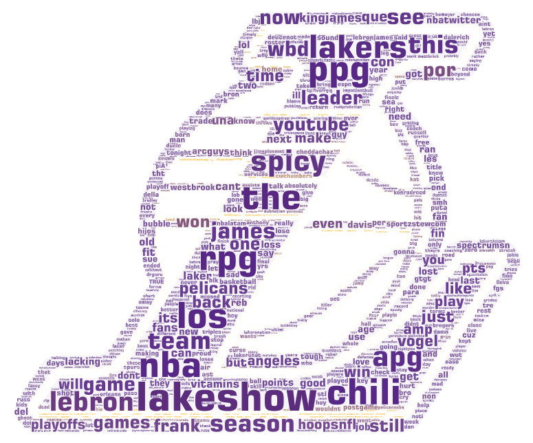

# Social Media in Basketball

Social Media in Basketball is my undergraduate thesis project that measures NBA team performance and fan Twitter sentiment to gauge fan engagement and revenue generation. The project consists of a sentiment analysis using RStudio and the Twitter API. Additional data gathered outside Twitter came from Basketball Reference, Wikipedia, ESPN, and Statista which are all mentioned in the thesis paper.

Please note that this project neither represents nor speaks on behalf of the NBA, Twitter, nor any of the organizations and people affiliated with the data analyzed. This project simply represents the metaphorical blood, sweat, and tears of a third-year college student who was hungry to create a project that explored his passions including basketball, data, and analytics as their honors thesis.

More information can be found in the thesis paper itself named [thesis_paper.pdf](https://github.com/MatthewCKwan/basketball-tweet-sentiment-analysis/blob/main/thesis_paper.pdf) which you can access within the repository.
## Table of Contents

[Installation](#installation)

[API Token Authorization](#api-token-authorization)

[Walkthrough](#walkthrough)

- [Phoenix Suns](#phoenix-suns)
- [Los Angeles Lakers](#los-angeles-lakers)
- [New Orleans Pelicans](#new-orleans-pelicans)
- [New York Knicks](#new-york-knicks)

[Tweet Word Art](#tweet-word-art)

[Interactive Tweet Word Art](#interactive-tweet-word-art)

[Author](#author)
## Installation

The following libraries were installed when using the academic level of Twitter API v2:

```r
  install.packages("academictwitteR")
  install.packages("sentimentr")
  install.packages("tidyverse")
  install.packages("dplyr")
  install.packages("corrplot")
  install.packages("ggplot2")
  install.packages("plotly")
  install.packages("plyr")
  install.packages("highcharter")
  install.packages("ggpubr")
  install.packages("rstatix")
```

The following libraries were installed when using the older Twitter API v1.1:

```r
  install.packages("twitteR")
  install.packages("tm")
  install.packages("ROAuth")
```

Please note that some of the libraries did not end up being used in the final publication of my thesis because when I was starting out, I was experimenting with multiple ways to visualize the data before deciding on a select few. I am still choosing to include all the libraries I referenced throughout the project in order to ensure nothing is missing from my R scripts which were last updated in April 2022.
## API Token Authorization

Shout-out to my thesis director Daniel McIntosh for granting me his access to the academic level of the Twitter API v2 authorized using the following:

```r
  set_bearer()
  get_bearer()
```

After successfully submitting an application and gaining approval for standard API access from Twitter, the authorization for the Twitter API v1.1 used the following:

```r
  consumer_key <- 'INSERT_CONSUMER_KEY'
  consumer_secret <- 'INSERT_CONSUMER_SECRET'
  access_token <- 'INSERT_ACCESS_TOKEN'
  access_secret <- 'INSERT_ACCESS_SECRET'
  setup_twitter_oauth(consumer_key, consumer_secret, access_token, access_secret)
```

Please note that Twitter has updated its Twitter API platform within the last year of writing this so be aware that the authorization methods listed above may be outdated.
## Walkthrough

The project involved running two hypothesis tests, two ANOVA tests, and one correlation test in total focusing on the Phoenix Suns, Los Angeles Lakers, New Orleans Pelicans, and New York Knicks.

### Phoenix Suns


**Hypothesis:** Playing with more offensive prowess measured from having a high-scoring game will increase Twitter fan sentiment versus having a low-scoring game.

**Test:** Two-sample t-test (1)

**# of Tweets:** 30000

**Search String Parameter:** `suns`

This code block shows pulling down and cleaning a random sample of 1000 tweets from the day of a Suns' high-scoring game against the Oklahoma City Thunder during the 2020-21 season:

```r
  suns_okc_hi_gm1_tweets <-
    get_all_tweets(
      query = "suns",
      start_tweets = "2021-04-02T07:00:00Z",
      end_tweets = "2021-04-03T06:59:00Z",
      data_path = "suns_okc_4-2/",
      bind_tweets = FALSE,
      n = 1000
    )
  suns_okc_hi_gm1_tweets <- bind_tweets(data_path = "suns_okc_4-2/")

  suns_okc_hi_gm1_tweets$text <- gsub("[^0-9A-Za-z///' ]","", suns_okc_hi_gm1_tweets$text)
  suns_okc_hi_gm1_tweets$text <- gsub("http\\w+", "", suns_okc_hi_gm1_tweets$text)
  suns_okc_hi_gm1_tweets$text <- gsub("rt", "", suns_okc_hi_gm1_tweets$text)
  suns_okc_hi_gm1_tweets$text <- gsub("@\\w+", "", suns_okc_hi_gm1_tweets$text)
  suns_okc_hi_gm1_tweets$text <- tolower(suns_okc_hi_gm1_tweets$text)

  sent_suns_okc_hi_gm1_tweets <- sentiment(suns_okc_hi_gm1_tweets$text)
  suns_okc_hi_gm1_tweets$sentiment <- sent_suns_okc_hi_gm1_tweets$sentiment

  suns_okc_hi_gm1_tweets <- suns_okc_hi_gm1_tweets %>% mutate(game_id = "hi_gm_1")

  rand_suns_okc_hi_gm1_tweets <- suns_okc_hi_gm1_tweets[sample(nrow(suns_okc_hi_gm1_tweets), size=1000), ]
```

This code block shows creating a "smaller" data frame for that 1000-tweet sample above by specifying columns to be retained:

```r
  sm_rand_suns_okc_hi_gm1_tweets <- rand_suns_okc_hi_gm1_tweets %>% select(created_at, id, author_id, possibly_sensitive, conversation_id, text, lang, source, in_reply_to_user_id, sentiment, game_id)
```

This code block shows merging the Suns' high-scoring game tweet samples into one data frame:

```r
  merge_hi_gms <- bind_rows(sm_rand_suns_okc_hi_gm1_tweets, sm_rand_suns_sas_hi_gm2_tweets, sm_rand_suns_was_hi_gm3_tweets, sm_rand_suns_cle_hi_gm4_tweets, sm_rand_suns_hou_hi_gm5_tweets, 
                            sm_rand_suns_nop_hi_gm6_tweets, sm_rand_suns_por_hi_gm7_tweets, sm_rand_suns_mem_hi_gm8_tweets, sm_rand_suns_mil_hi_gm9_tweets, sm_rand_suns_nyk_hi_gm10_tweets, 
                            sm_rand_suns_por_hi_gm11_tweets, sm_rand_suns_den_hi_gm12_tweets, sm_rand_suns_hou_hi_gm13_tweets, sm_rand_suns_ind_hi_gm14_tweets, sm_rand_suns_mil_hi_gm15_tweets)
```

This code block shows running the test followed by creating a box plot:

```r
  t.test(merge_hi_gms$sentiment, merge_lo_gms$sentiment, mu=0, alt="two.sided", conf=0.95, var.eq=F, paired=F)

  plot_ly(
    data = merge_hi_and_lo_gms,
    y = ~sentiment,
    x = ~scoring_type,
    type = "box",
    color = ~scoring_type,
    showlegend = FALSE
  )
```

Box Plot:



### Los Angeles Lakers


**Hypothesis:** Achieving game victory measured from accruing game wins will increase Twitter fan sentiment versus accruing game losses.

**Test:** Two-sample t-test (1)

**# of Tweets:** 30000

**Search String Parameter:** `lakers`

This code block shows pulling down and cleaning a random sample of 1000 tweets from the day of a Lakers' game won against the Minnesota Timberwolves during the 2020-21 season:

```r
  w_gm1_lakers_min_tweets <-
    get_all_tweets(
      query = "lakers",
      start_tweets = "2021-03-16T07:00:00Z",
      end_tweets = "2021-03-17T06:59:00Z",
      data_path = "h2_lakers_min_3-16/",
      bind_tweets = FALSE,
      n = 1000
    )
  w_gm1_lakers_min_tweets <- bind_tweets(data_path = "h2_lakers_min_3-16/")

  w_gm1_lakers_min_tweets$text <- gsub("[^0-9A-Za-z///' ]","", w_gm1_lakers_min_tweets$text)
  w_gm1_lakers_min_tweets$text <- gsub("http\\w+", "", w_gm1_lakers_min_tweets$text)
  w_gm1_lakers_min_tweets$text <- gsub("rt", "", w_gm1_lakers_min_tweets$text)
  w_gm1_lakers_min_tweets$text <- gsub("@\\w+", "", w_gm1_lakers_min_tweets$text)
  w_gm1_lakers_min_tweets$text <- tolower(w_gm1_lakers_min_tweets$text)

  sent_w_gm1_lakers_min_tweets <- sentiment(w_gm1_lakers_min_tweets$text)
  w_gm1_lakers_min_tweets$sentiment <- sent_w_gm1_lakers_min_tweets$sentiment

  w_gm1_lakers_min_tweets <- w_gm1_lakers_min_tweets %>% mutate(game_id = "w_gm_1")

  rand_w_gm1_lakers_min_tweets <- w_gm1_lakers_min_tweets[sample(nrow(w_gm1_lakers_min_tweets), size=1000), ]
```

This code block shows creating a "smaller" data frame for that 1000-tweet sample above by specifying columns to be retained:

```r
  sm_rand_w_gm1_lakers_min_tweets <- rand_w_gm1_lakers_min_tweets %>% select(created_at, id, author_id, possibly_sensitive, conversation_id, text, lang, source, in_reply_to_user_id, sentiment, game_id)
```

This code block shows merging the Lakers' victorious game tweet samples into one data frame:

```r
  merge_gms_w <- bind_rows(sm_rand_w_gm1_lakers_min_tweets, sm_rand_w_gm2_lakers_chi_tweets, sm_rand_w_gm3_lakers_chi_tweets, sm_rand_w_gm4_lakers_uta_tweets, sm_rand_w_gm5_lakers_ind_tweets, 
                          sm_rand_w_gm6_lakers_cha_tweets, sm_rand_w_gm7_lakers_ind_tweets, sm_rand_w_gm8_lakers_cle_tweets, sm_rand_w_gm9_lakers_por_tweets, sm_rand_w_gm10_lakers_sas_tweets, 
                          sm_rand_w_gm11_lakers_nop_tweets, sm_rand_w_gm12_lakers_mem_tweets, sm_rand_w_gm13_lakers_okc_tweets, sm_rand_w_gm14_lakers_gsw_tweets, sm_rand_w_gm15_lakers_cha_tweets)
```

This code block shows running the test followed by creating a box plot:

```r
  t.test(merge_gms_l$sentiment, merge_gms_w$sentiment, mu=0, alt="two.sided", conf=0.95, var.eq=F, paired=F)

  plot_ly(
    data = merge_l_and_w_gms,
    y = ~sentiment,
    x = ~game_outcome,
    type = "box",
    color = ~game_outcome,
    showlegend = FALSE
  )
```

Box Plot:



### New Orleans Pelicans


**Hypothesis:** The effect of a team winning at home versus away on the road during the regular season on Twitter fan sentiment will differ between these two locations where a game is won.

**Test:** One-way ANOVA (2)

**# of Tweets:** 30000

**Search String Parameter:** `@PelicansNBA`

This code block shows pulling down and cleaning a random sample of 1000 tweets from the day of a Pelicans' game won on the road against the Golden State Warriors during the 2019-20 season:

```r
  gm29_tweets <-
    get_all_tweets(
      query = "@PelicansNBA",
      start_tweets = "2020-02-23T07:00:00Z",
      end_tweets = "2020-02-24T06:59:00Z",
      data_path = "anova_gm_29/",
      bind_tweets = FALSE,
      n = 1000
    )
  gm29_tweets <- bind_tweets(data_path = "anova_gm_29/")

  gm29_tweets$text <- gsub("[^0-9A-Za-z///' ]","", gm29_tweets$text)
  gm29_tweets$text <- gsub("http\\w+", "", gm29_tweets$text)
  gm29_tweets$text <- gsub("rt", "", gm29_tweets$text)
  gm29_tweets$text <- gsub("@\\w+", "", gm29_tweets$text)
  gm29_tweets$text <- tolower(gm29_tweets$text)

  sent_gm29_tweets <- sentiment(gm29_tweets$text)
  gm29_tweets$sentiment <- sent_gm29_tweets$sentiment

  gm29_tweets <- gm29_tweets %>% mutate(game_id = "gm_29_gsw")
  gm29_tweets <- gm29_tweets %>% mutate(location_id = "away")

  rand_gm29_tweets <- gm29_tweets[sample(nrow(gm29_tweets), size=1000), ]
```

This code block shows creating a "smaller" data frame for that 1000-tweet sample above by specifying columns to be retained:

```r
  sm_rand_gm29_tweets <- rand_gm29_tweets %>% select(created_at, id, author_id, possibly_sensitive, conversation_id, text, lang, source, in_reply_to_user_id, sentiment, game_id, location_id)
```

This code block shows merging all thirty of the Pelicans' victorious home and away game tweet samples into one data frame:

```r
  merge_gms_h_and_a <- bind_rows(sm_rand_gm1_tweets, sm_rand_gm2_tweets, sm_rand_gm3_tweets, 
                                sm_rand_gm4_tweets, sm_rand_gm5_tweets, sm_rand_gm6_tweets, 
                                sm_rand_gm7_tweets, sm_rand_gm8_tweets, sm_rand_gm9_tweets, 
                                sm_rand_gm10_tweets, sm_rand_gm11_tweets, sm_rand_gm12_tweets, 
                                sm_rand_gm13_tweets, sm_rand_gm14_tweets, sm_rand_gm15_tweets, 
                                sm_rand_gm16_tweets, sm_rand_gm17_tweets, sm_rand_gm18_tweets, 
                                sm_rand_gm19_tweets, sm_rand_gm20_tweets, sm_rand_gm21_tweets, 
                                sm_rand_gm22_tweets, sm_rand_gm23_tweets, sm_rand_gm24_tweets, 
                                sm_rand_gm25_tweets, sm_rand_gm26_tweets, sm_rand_gm27_tweets, 
                                sm_rand_gm28_tweets, sm_rand_gm29_tweets, sm_rand_gm30_tweets)
```

This code block shows running the first of two ANOVA tests followed by creating a box plot:

```r
  anova_model <- aov(sentiment ~ location_id, data = merge_gms_h_and_a)
  summary(anova_model)

  plot_ly(
    data = merge_gms_h_and_a,
    y = ~sentiment,
    x = ~location_id,
    type = "box",
    color = ~location_id,
    showlegend = FALSE
  )
```

Box Plot:



### New York Knicks


**Hypothesis:** There will be a positive correlation between Twitter fan sentiment and game attendance.

**Test:** Correlation test (1)

**# of Tweets:** 30000

**Search String Parameter:** `knicks`

This code block shows pulling down and cleaning a random sample of 1000 tweets from the day of the Knicks' first home game of the 2018-19 season to store the mean sentiment value of that sample:

```r
  gm1_tweets <-
    get_all_tweets(
      query = "knicks",
      start_tweets = "2018-10-17T07:00:00Z",
      end_tweets = "2018-10-18T06:59:00Z",
      data_path = "cor_gm1/",
      bind_tweets = FALSE,
      n = 1000
    )
  gm1_tweets <- bind_tweets(data_path = "cor_gm1/")

  gm1_tweets$text <- gsub("[^0-9A-Za-z///' ]","", gm1_tweets$text)
  gm1_tweets$text <- gsub("http\\w+", "", gm1_tweets$text)
  gm1_tweets$text <- gsub("rt", "", gm1_tweets$text)
  gm1_tweets$text <- gsub("@\\w+", "", gm1_tweets$text)
  gm1_tweets$text <- tolower(gm1_tweets$text)

  sent_gm1_tweets <- sentiment(gm1_tweets$text)
  gm1_tweets$sentiment <- sent_gm1_tweets$sentiment

  gm1_tweets <- gm1_tweets %>% mutate(game_id = "gm1_atl")

  rand_gm1_tweets <- gm1_tweets[sample(nrow(gm1_tweets), size=1000), ]

  gm1_mean_sent <- mean(rand_gm1_tweets$sentiment)
```

This code block shows creating a data frame that houses the first thirty home games for the Knicks in the 2018-19 season and their attendance numbers pulled from ESPN:

```r
  cor_df <- data.frame(game_mean_sentiment = c(gm1_mean_sent, gm2_mean_sent, 
                                              gm3_mean_sent, gm4_mean_sent, 
                                              gm5_mean_sent, gm6_mean_sent, 
                                              gm7_mean_sent, gm8_mean_sent, 
                                              gm9_mean_sent, gm10_mean_sent, 
                                              gm11_mean_sent, gm12_mean_sent, 
                                              gm13_mean_sent, gm14_mean_sent, 
                                              gm15_mean_sent, gm16_mean_sent, 
                                              gm17_mean_sent, gm18_mean_sent, 
                                              gm19_mean_sent, gm20_mean_sent, 
                                              gm21_mean_sent, gm22_mean_sent, 
                                              gm23_mean_sent, gm24_mean_sent, 
                                              gm25_mean_sent, gm26_mean_sent, 
                                              gm27_mean_sent, gm28_mean_sent, 
                                              gm29_mean_sent, gm30_mean_sent), 
                      game_attendance = c(18249, 19427, 19812, 19221, 18295, 
                                          19812, 19812, 19812, 18948, 19812, 
                                          19440, 18662, 18602, 18437, 19080, 
                                          19812, 19812, 18596, 19493, 18819, 
                                          18852, 18842, 18343, 17025, 17853, 
                                          18886, 18983, 19096, 18019, 17833),
                      g_a_div_by_100k = c(18249/100000, 19427/100000, 
                                          19812/100000, 19221/100000, 
                                          18295/100000, 19812/100000, 
                                          19812/100000, 19812/100000, 
                                          18948/100000, 19812/100000, 
                                          19440/100000, 18662/100000, 
                                          18602/100000, 18437/100000, 
                                          19080/100000, 19812/100000, 
                                          19812/100000, 18596/100000, 
                                          19493/100000, 18819/100000, 
                                          18852/100000, 18842/100000, 
                                          18343/100000, 17025/100000, 
                                          17853/100000, 18886/100000, 
                                          18983/100000, 19096/100000, 
                                          18019/100000, 17833/100000),
                      g_a_div_by_1mil = c(18249/1000000, 19427/1000000, 
                                          19812/1000000, 19221/1000000, 
                                          18295/1000000, 19812/1000000, 
                                          19812/1000000, 19812/1000000, 
                                          18948/1000000, 19812/1000000, 
                                          19440/1000000, 18662/1000000, 
                                          18602/1000000, 18437/1000000, 
                                          19080/1000000, 19812/1000000, 
                                          19812/1000000, 18596/1000000, 
                                          19493/1000000, 18819/1000000, 
                                          18852/1000000, 18842/1000000, 
                                          18343/1000000, 17025/1000000, 
                                          17853/1000000, 18886/1000000, 
                                          18983/1000000, 19096/1000000, 
                                          18019/1000000, 17833/1000000),
                      game_num = c("gm_1", "gm_2", "gm_3", "gm_4", "gm_5", 
                                    "gm_6", "gm_7", "gm_8", "gm_9", "gm_10", 
                                    "gm_11", "gm_12", "gm_13", "gm_14", "gm_15", 
                                    "gm_16", "gm_17", "gm_18", "gm_19", "gm_20", 
                                    "gm_21", "gm_22", "gm_23", "gm_24", "gm_25", 
                                    "gm_26", "gm_27", "gm_28", "gm_29", "gm_30"),
                      date = c("2018-10-17", "2018-10-20", "2018-10-26", 
                                "2018-10-29", "2018-10-31", "2018-11-05", 
                                "2018-11-11", "2018-11-20", "2018-11-23", 
                                "2018-12-01", "2018-12-03", "2018-12-08", 
                                "2018-12-09", "2018-12-17", "2018-12-21", 
                                "2018-12-25", "2019-01-11", "2019-01-13", 
                                "2019-01-21", "2019-01-23", "2019-01-27", 
                                "2019-01-30", "2019-02-01", "2019-02-03", 
                                "2019-02-05", "2019-02-09", "2019-02-13", 
                                "2019-02-22", "2019-02-24", "2019-02-26")
  )

  cor_df[['date']] <- as.Date(cor_df[['date']], 
                              format = "%Y-%m-%d")
```

This code block shows running the test followed by creating a scatter plot:

```r
  cor.test(cor_df$game_mean_sentiment, cor_df$game_attendance)

  hc_sp_2 <- hchart(
    cor_df, "scatter", 
    hcaes(x = game_attendance, y = game_mean_sentiment)
  )

  hc_sp_2
```

Scatter Plot:



## Tweet Word Art

The data collection behind creating the following tweet word art used the Twitter API v1.1 instead of v2. [WordArt.com](https://wordart.com/) was used to create the following three visuals once the data was uploaded to the site in the form of a CSV file per visual.

This code block shows the collection and cleaning of words from tweets that are saved to a CSV file regarding LeBron James using the search string `@KingJames` which is James' Twitter handle:

```r
  ### Search String: @KingJames
  lbj_tweets <- searchTwitter("@KingJames",n=1000)

  ## count number of tweets
  n.tweets <- length(lbj_tweets)
  n.tweets

  ## convert tweets into dataframe
  lbj_tweets.df <- twListToDF(lbj_tweets)
  View(lbj_tweets.df)

  ## cleaning the text
  myCorpus <- Corpus(VectorSource(lbj_tweets.df$text))
  myCorpus <- tm_map(myCorpus, removeWords, stopwords())

  myStopWords <- "@KingJames"
  myCorpus <- tm_map(myCorpus, removeWords, myStopWords)

  remove_url <- function(x) gsub("http[^[:space:]]*","",x)
  myCorpus <- tm_map(myCorpus, content_transformer(remove_url))

  removeNumPunct <- function(x) gsub("[^[:alpha:][:space:]]*","",x)
  myCorpus <- tm_map(myCorpus, content_transformer(removeNumPunct))
  myCorpus <- tm_map(myCorpus, removePunctuation)
  myCorpus <- tm_map(myCorpus, content_transformer(tolower))
  myCorpus <- tm_map(myCorpus, stripWhitespace)
  myCorpus <- tm_map(myCorpus, stemDocument)

  dtm <- TermDocumentMatrix(myCorpus)
  dtm <- as.matrix(dtm)
  dtm <- sort(rowSums(dtm),decreasing=TRUE)
  dtm <- data.frame(word = names(dtm),freq=dtm)
  View(dtm)

  ## writing the data frame to a CSV and saving to Downloads directory
  write.csv(dtm, "C:\\Users\\INSERT_DIRECTORY_NAME\\
            Downloads\\lbj_tweet_words.csv", row.names = FALSE)
```

Here is the before and after of the LeBron James' tweet word art:





I followed an identical method for the Phoenix Suns and Los Angeles Lakers where I passed in their hashtag phrases: `#RallyTheValley` and `#LakeShow`, respectively.

Here is the art for those two hashtag phrases:




## Interactive Tweet Word Art

Links to interactive versions of the tweet word art on [WordArt.com](https://wordart.com/) labeled by search string.

- [@KingJames](https://wordart.com/rg1hr3g5r3e6/kingjames)
- [#RallyTheValley](https://wordart.com/melaj27w520l/ralleythevalley)
- [#LakeShow](https://wordart.com/lzcmbtfl2k23/lakeshow)

## Author

- [Matthew Kwan](https://www.linkedin.com/in/matthew-kwan/)
